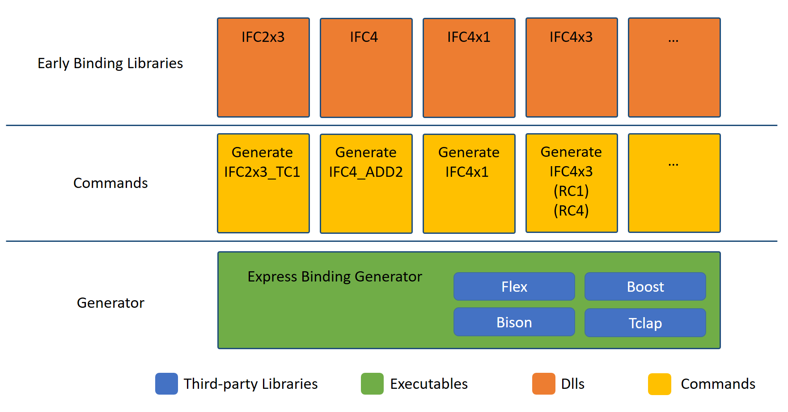
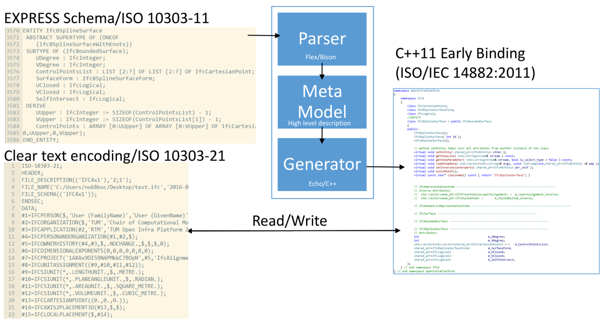

# Software Architecture

*NOTE:* This document shows the overall software architecture of the Open Infra Platform 
and the Express Binding Generator as of the current state (August 2021). 

## Content 

1. [Overall Software Architecture](#Overall_architecture)
    * [Fundaments](#Fundaments)
    * [Modules](#Modules)
    * [User Interface](#UI)
2. [Express Binding Generator](#Express_binding) 
	* [Executables](#Exec)
	* [Commands](#Commands)
	* [Early Binding Library](#Early_binding_lib)

##  Overall Software Architecture

This section gives a general overview of the software architecture of the Open Infra Platform 
with its core software modules together with their interrelations.
Furthermore, dependencies on third-party libraries are stated. 

###  Fundaments
The _Base_ module constitutes the backbone of the Open Infra Platform, 
with all of the other software parts building upon it. 
As its main part, several third-party libraries are linked here. 
Other than that, it also provides very fundamental elements like the _IModel_ interface 
that is implemented by the upper layers for every supported file format (e.g., `IFC` and `OFF`)
and provides some basic information about the input files. 
Furthermore, classes and structures for georeferencing metadata and simple bounding boxes are given.
The third-party libraries linked to this module are Boost, BlueFramework, Carve, Tclap, FFTW3, and Doxygen.
More details on these libraries can be found [here](Licenses/readme.md).

###  Modules

The modules can be separated into two central parts. 
First of all, the _Core_ module links to the third-party libraries `Eigen` and `Qt`.
It also comprises one submodule for the IFC (Industry Foundation Classes) and OFF (Object File Format) file format each. 
In the case of IFC, the _IFC Geometry Converter_ takes care of the geometric conversion processes. 
It makes use of the _Express Binding Library_, which is generated by the [Express Binding Generator](#Express_binding). 

The IFC file format supports all sorts of geometric representations 
ranging from boundary representation and constructive solid geometry to sweep volumes.
This includes implicit as well as explicit geometric representations. 
In order to be able to render these complex geometries described in an IFC file, 
the _IFC Geometry Converter_ has to convert the geometric descriptions 
specified in IFC into a triangle mesh that can be understood by the rendering engine.
This step is based on the geometry kernel `carve`. 
Since IFC encompasses a multitude of representations and is constantly updating, 
only a subset of the _IfcRepresentationItems_ are supported at the moment, 
focusing on the most frequently used ones. 
However, OIP is continuously expanding to cover more and more types of representations. 
To check which representation items are currently supported, 
the user can take a look at the [List of supported IFC Representations](./SupportedIFCrepresentations.md). 

The other part of the _Core_ module consists of the _OFF Geometry Converter_. 
This format specifies tessellations of objects with the help of triangles, quadrilaterals, hexagons, and similar surfaces. 
The conversion process is a lot simpler in comparison to the IFC format 
since the OFF format is limited to this specific geometric representation.

Moreover, OIP includes the _Point Cloud Processing_ module. 
This module enables the visualization of point clouds of the file format `.bin` (native CloudCompare format), `.las`, and others. 
Additionally, octrees can be visualized, and basic point cloud processing functionalities are provided.
This point cloud module has references to Qt5, Liblas, Eigen, and CloudCompare ([more details](Licenses/readme.md)).

By default, the _Point Cloud Processing_ module is deactivated. 
In order to make use of it, OIP needs to be built with the corresponding `CMake` option selected 
(for further details, see [CMake Options Documentation](Documentation/markdown/CMakeOptions.md)). 
A significant advantage is that the _Core_ and the _Point Cloud Processing_ module can be run simultaneously 
so that, e.g., one can open an IFC file and a point cloud 
at the same time to compare them to each other directly.

###  User Interface

The underlying part of the user interface is the _Rendering module_. 
This links to a self-written rendering engine called _BlueFramework_ ([see repository](https://github.com/tumcms/Blue-Framework)). 
Depending on the objects that are to be displayed, different types of shaders and effects are implemented. 

The _Graphical User Interface_ is built on top of this, 
which has a 3D viewport to display geometric objects and several menus and buttons that provide functions to interact with them. 
The GUI bases on the `Qt` library, which has an extensive catalog of ready-to-use user interface elements. 
Other third-party libraries that the GUI uses are Zlib and Proj (for more details see [here](Licenses/readme.md))

###  Unit Testing

The _Unit Testing_ part of OIP is based on `Google Test`. 
Since many unit tests that are implemented in OIP use visual comparison, 
the unit test base includes a geometry model renderer that allows rendering without the use of the _Graphical User Interface_. 
On top of that, there are various individual unit tests for IFC, OFF, and point clouds (and also some other more general unit tests?). 
These provide automated checking to guarantee that implemented functionalities are all still in place and working as expected. 
For the case of the IFC format, the [List of supported IFC Representations](./SupportedIFCrepresentations.md) 
provides information about which representations currently have at least one unit test in place.

##  Express Binding Generator

This section gives a short overview of how the _Express Binding Generator_ is working. 
The general task of the _Express Binding Generator_ is to read an IFC schema in the form of an EXPRESS schema definition 
and automatically create early binding C++ classes mirroring the IFC entities. 
This allows to find coding errors already at compile time. 
The _Express Binding Generator_ consists of three main parts: 
the executables, the commands, and the early binding library. 
These are explained in more detail in the following sections.

 

###  Executables 

In the executables, the basic functionalities are defined, which state how the IFC EXPRESS schemas are converted to C++ classes,
taking into account entities, inverse attributes, attributes, types, and SELECT clauses. 
Flex and Bison generate a corresponding meta-model representation in C++, 
which needs to overcome fundamental differences between C++ and EXPRESS.
The executables make use of the third-party libraries Flex, Bison, Tclap, and Boost ([more details](Licenses/readme.md)))

Not all parts of the EXPRESS schema are supported at the moment.
Keywords of the EXPRESS schema language that are not supported are:
* WHERE 
* FUNCTION
* RULE
* DERIVE

###  Commands
The commands are helper functions to be directly started from Visual Studio.
In this section, the selected EXPRESS file is read, and then according to the schema, 
the C++ classes are generated. 
A current limitation of OIP is that simultaneously linking various IFC versions is not possible
since they have overlapping classes with various differences that are not yet addressed. 
Therefore one needs to select the desired IFC version for the build process, 
as described in the [CMake Options Documentation](Documentation/markdown/CMakeOptions.md). Every time the IFC Version is changed, the solution needs to be rebuilt. 

The supported IFC versions are:
* IFC2x3_TC1
* IFC2x4_RC3
* IFC4_ADD2
* IFC4x1_RC3
* IFC4x2 (BIMROAD and DRAFT_1)
* IFC4x3 (RC1 and RC4)

It is relatively easy to introduce more recent IFC versions to OIP. All that is needed is the new schema definition in the form of the EXPRESS file. With this, the early binding generator creates C++ classes for all entities accordingly. Similar to the already implemented IFC versions, the OIP functionalities can then be modified based on the changes introduced through the new IFC version. With this, it is also possible to develop future IFC extensions and test their behaviour with low implementation effort.

###  Early Binding Library

Once a specific command is executed and the IFC classes have been built, 
they are ready to use in the form of a library.
This gets linked to _Core_ module.

For a more detailed description of the OIP software architecture take a look at the paper by [Hecht and Jaud 2019](Documentation/2019_Hecht_Jaud_FBI.pdf)